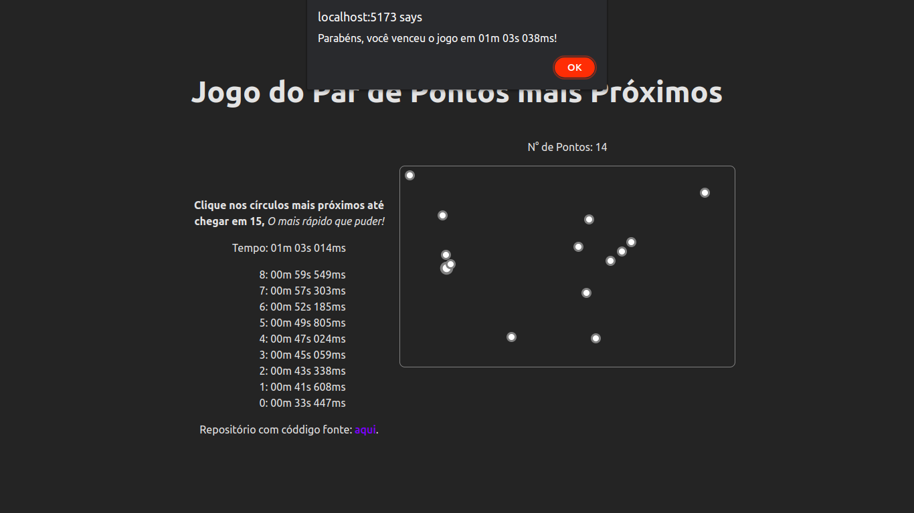

# Jogo: Par de Pontos Mais Próximos

**Número da Lista**: 19

**Conteúdo da Disciplina**: Dividir e Conquistar


## Alunos
|Matrícula | Aluno |
| -- | -- |
| 16/0149410  |  Yudi Yamane |

## Sobre 
Esse é um jogo em que você deve clicar no par de pontos mais próximos. Ganha
aquele que chegar ao nível 15 mais rápido (infelizmente não deu tempo 
implementar ranking online).

Mas você ainda pode competir com seus colegas no mesmo computador xD

## Screenshots


Screenshot do início do jogo.


Você recebe feedback instatâneo sobre o seu chute;



O jogo termina parabenizando o jogador e mostrando quanto tempo durou.


## Instalação 
**Linguagem**: TypeScript

**Framework**: Svelte

Descreva os pré-requisitos para rodar o seu projeto e os comandos necessários.

## Uso 
Você precisa do [Node.js](https://nodejs.org/en) versão 16+ e de um gerenciador
de pacotes como
[npm](https://docs.npmjs.com/downloading-and-installing-node-js-and-npm) ou
[pnpm](https://pnpm.io/installation).

Instale as dependências:

```sh
npm i
# ou se você usa pnpm:
pnpm i
```

Inicie o servidor da aplicação:

```sh
npm run dev
# ou
pnpm dev
```

Acesse a aplicação em http://localhost:5173/.

## Uso 

É só ir clicando nos círculos e ver a mágica acontecer :D


